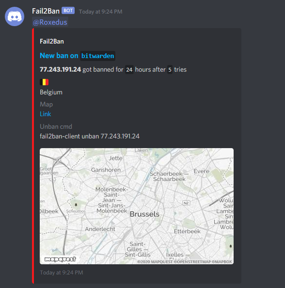

# THIS MOD HAS BEEN DEPRECATED - Please use [swag-f2bdiscord](https://github.com/linuxserver/docker-mods/tree/swag-f2bdiscord) instead


# F2B Discord Notification - Docker mod which allows Fail2Ban Discord embeds

This mod enhances the Letsencrypt container adding better Fail2Ban notifications for discord.

## Configuration

### Enable

In letsencrypt docker arguments, set an environment variable `DOCKER_MODS=linuxserver/mods:letsencrypt-f2bdiscord` to enable.

### Mod configuration

**Environment variables used by this mod:**

[Discord webhook](https://support.discordapp.com/hc/en-us/articles/228383668-Intro-to-Webhooks), it just need the last parts. `-e DISC_HOOK=40832456738934/7DcEpWr5V24OIEIELjg-KkHky86SrOgTqA`  
[Your discord ID](https://support.discordapp.com/hc/en-us/articles/206346498-Where-can-I-find-my-User-Server-Message-ID-). `-e DISC_ME=120970603556503552`  
[Map API Key](https://developer.mapquest.com/), get a key from mapquest. `-e DISC_API=YourKey`

#### Jail configuration example

```ini
[bitwarden]

filter  = bitwarden
enabled = true
logpath = /fail2ban/bw/bitwarden.log
action  = discordEmbed[bantime=24]
          iptables-allports[name=Bitwarden]

```

Action arguments:

`bantime`(hour) is optional, but defaults to 24 when not set. Just reflects in the message, does not change the ban time

## Example


