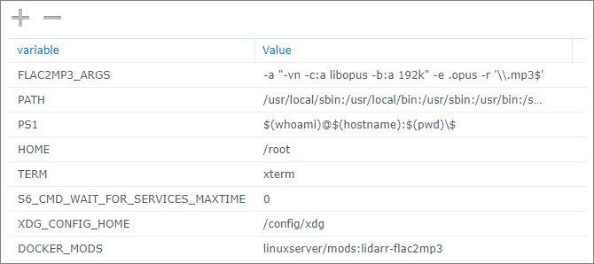

# About
A [Docker Mod](https://github.com/linuxserver/docker-mods) for the LinuxServer.io Lidarr Docker container that uses ffmpeg and a script to automatically convert downloaded FLAC (or other format) files to MP3s.  Default output quality is 320Kbps constant bit rate.
Advanced options act as a light wrapper to ffmpeg, allowing conversion to any supported audio format, including AAC, AC3, Opus, and many others.
A [Batch Mode](./README.md#batch-mode) is also supported that allows usage outside of Lidarr.

>**NOTE:** This mod supports Linux OSes only.

Production Container info:   
Development Container info:


# Installation
1. Pull the [linuxserver/lidarr](https://hub.docker.com/r/linuxserver/lidarr "LinuxServer.io's Lidarr container") docker image from GitHub Container Registry or Docker Hub:  
  `docker pull lscr.io/linuxserver/lidarr:latest`

2. Configure the Docker container with all the port, volume, and environment settings from the *original container documentation* here:  
  **[linuxserver/lidarr](https://hub.docker.com/r/linuxserver/lidarr "Docker container")**
   1. Add a **DOCKER_MODS** environment variable to the `docker run` command, as follows:  
      - Stable release: `-e DOCKER_MODS=linuxserver/mods:lidarr-flac2mp3`
      - Dev/test release: `-e DOCKER_MODS=thecaptain989/lidarr-flac2mp3:latest`

      *Example Docker CLI Configuration*  
       ```shell
       docker run -d \
         --name=lidarr \
         -e PUID=1000 \
         -e PGID=1000 \
         -e TZ=America/Chicago \
         -e DOCKER_MODS=linuxserver/mods:lidarr-flac2mp3 \
         -p 8686:8686 \
         -v /path/to/appdata/config:/config \
         -v /path/to/music:/music \
         -v /path/to/downloads:/downloads \
         --restart unless-stopped \
         lscr.io/linuxserver/lidarr
       ```   

      *Example Synology Configuration*  
      

   2. Start the container.

3. Configure a custom script from Lidarr's *Settings* > *Connect* screen and type the following in the **Path** field:  
   `/usr/local/bin/flac2mp3.sh`

   *Example*  
   

   This will use the defaults to create a 320Kbps MP3 file.

   *For any other setting, you **must** use one of the supported methods to pass arguments to the script.  See the [Syntax](./README.md#syntax) section below.*

## Usage
New file(s) will be placed in the same directory as the original FLAC file(s) (unless redirected with the `--output` option below) and have the same owner and permissions. Existing files with the same track name will be overwritten.

By default, if you've configured Lidarr's **Recycle Bin** path correctly, the original audio file will be moved there.  
![danger] **NOTE:** If you have *not* configured the Recycle Bin, the original FLAC audio file(s) will be deleted and permanently lost.  This behavior may be modified with the `--keep-file` option.

### Syntax
>**Note:** The _Arguments_ field for Custom Scripts was removed in Lidarr release [v0.7.0.1347](https://github.com/lidarr/Lidarr/commit/b9d240924f8965ebb2c5e307e36b810ae076101e "Lidarr commit notes") due to security concerns.

To supply arguments to the script, you **must** either use one of the **[included wrapper scripts](./README.md#included-wrapper-scripts)**, create a **[custom wrapper script](./README.md#example-wrapper-script)**, or set the `FLAC2MP3_ARGS` **[environment variable](./README.md#environment-variable)**.

#### Command Line Options and Arguments
The script may be called with optional command line arguments.

The syntax for the command line is:  
`flac2mp3 [{-d|--debug} [<level>]] [{-b|--bitrate} <bitrate> | {-v|--quality} <quality> | {-a|--advanced} "<options>" {-e|--extension} <extension>] [{-f|--file} <audio_file>] [{-k|--keepfile}] [{-o|--output} <directory>] [{-r|--regex} '<regex>'] [{-t|--tags} <taglist>]`  

Where:

Option|Argument|Description
---|---|---
-d, --debug|\[\<level\>\]|Enables debug logging. Level is optional.<br/>Default of 1 (low).<br/>2 includes JSON and FFmpeg output.<br/>3 contains even more JSON output.
-b, --bitrate|\<bitrate\>|Sets the output quality in constant bits per second (CBR).<br/>Examples: 160k, 240k, 300000<br/>**Note:** May not be specified with `-v`, `-a`, or `-e`.
-v, --quality|\<quality\>|Sets the output variable bit rate (VBR).<br/>Specify a value between 0 and 9, with 0 being the highest quality.<br/>See the [FFmpeg MP3 Encoding Guide](https://trac.ffmpeg.org/wiki/Encode/MP3) for more details.<br/>**Note:** May not be specified with `-b`, `-a`, or `-e`.
-a, --advanced|\"\<options\>\"|Advanced ffmpeg options.<br/>The specified `options` replace all script defaults and are sent directly to ffmpeg.<br/>The `options` value must be enclosed in quotes.<br/>See [FFmpeg Options](https://ffmpeg.org/ffmpeg.html#Options) for details on valid options, and [Guidelines for high quality audio encoding](https://trac.ffmpeg.org/wiki/Encode/HighQualityAudio) for suggested usage.<br/>**Note:** Requires the `-e` option to also be specified. May not be specified with `-v` or `-b`.<br/>![warning] **WARNING:** You must specify an audio codec (by including a `-c:a <codec>` ffmpeg option) or the resulting file will contain no audio!<br/>![warning] **WARNING:** Invalid `options` could result in script failure!
-e, --extension|\<extension\>|Sets the output file extension.<br/>The extension may be prefixed by a dot (".") or not.<br/>Example: .ogg<br/>**Note:** Requires the `-a` option to also be specified. May not be specified with `-v` or `-b`.
-f, --file|<audio_file>|If included, the script enters **[Batch Mode](./README.md#batch-mode)** and converts the specified audio file.<br/>![warning] **WARNING:** Do not use this argument when called from Lidarr!
-o, --output|\<directory\>|Converted audio file(s) are saved to `directory` instead of being located in the same directory as the source audio file.<br/>The path will be created if it does not exist.
-k, --keep-file| |Do not delete the source file or move it to the Lidarr Recycle bin.<br/>**Note:** This also disables importing the new files into Lidarr after conversion.
-r, --regex|'\<regex\>'|Sets the regular expression used to select input files.<br/>The `regex` value should be enclosed in single quotes and escaped properly.<br/>Defaults to `[.]flac$`.
-t, --tags|\<taglist\>|Comma separated list of metadata tags to apply automated corrections to.<br/>See [Metadata Corrections](./README.md#metadata-corrections) section.
--help| |Display help and exit.
--version| |Display version and exit.

If neither `-b`, `-v`, `-a`, or `-e` options are specified, the script will default to a constant 320Kbps MP3.

#### Technical notes on advanced options
The `-a` option effectively makes the script a generic wrapper for ffmpeg.  FFmpeg is executed once per track with only the loglevel, input filename, and output filename being set.  All other options are passed unparsed to the command line.  

The exact format of the executed ffmpeg command is:
```
ffmpeg -loglevel error -nostdin -i "input.flac" ${options} "output.${extension}"
```

#### Technical notes on regex
By default, the script only matches and interacts with FLAC files (specifically, files ending in ".flac"). The `-r` option allows the script to match on a user specified regular expression (i.e. "regex") pattern. 

Files are passed to the script with the full Linux path intact. (Ex: `/path/to/audio/a-ha/Hunting High and Low/01 Take on Me.mp3`).  Craft your regex with this in mind.

![warning] **NOTE:** Escaping special regex characters (like a dot `.`) requires a double backslash or a character class. A character class (i.e. `[.]`) is recommended because backslashes can be stripped by the bash shell and getting this right can be confusing.

For example, to convert all audio files to AAC audio files, use the following options:  
```
-a "-y -map 0 -c:a aac -b:a 240k -c:v copy" -e m4a --regex '[.][^.]*$'
```

Regular expression syntax is beyond the scope of this document.  See this [tutorial](https://www.regular-expressions.info/tutorial.html "Regular Expressions Tutorial") for more information. Regex patterns may be tested [here](http://regexstorm.net/tester "regex tester").

### Examples
```
-b 320k        # Output 320 kbit/s MP3 (non-VBR; same as default behavior)
-v 0           # Output variable bitrate MP3, VBR 220-260 kbit/s
-d -b 160k     # Enable debugging level 1, and output a 160 kbit/s MP3
-r '[.][^.]*$' # Convert any file to MP3 (not just FLAC)
-a "-c:v libtheora -map 0 -q:v 10 -c:a libopus -b:a 192k" -e .opus
               # Convert to Opus format, 192 kbit/s, cover art
-a "-vn -c:a libopus -b:a 192K" -e .opus -r '[.]mp3$'
               # Convert .mp3 files to Opus format, 192 kbit/s, no cover art
-a "-y -map 0 -c:a aac -b:a 240k -c:v copy" -e m4a
               # Convert to M4A format, using AAC 240 kbit/s audio, cover art, overwrite file
--file "/path/to/audio/a-ha/Hunting High and Low/01 Take on Me.flac"
               # Batch Mode
               # Output 320kbit/s MP3
-o "/path/to/audio" -k
               # Place the converted file(s) in the specified directory and do not delete the original audio file(s)
```

#### Included Wrapper Scripts
For your convenience, several wrapper scripts are included in the `/usr/local/bin/` directory.  
You may use any of these scripts in place of the `flac2mp3.sh` mentioned in the [Installation](./README.md#installation) section above.

```
flac2mp3-debug.sh        # Enable debugging, level 1
flac2mp3-debug-2.sh      # Enable debugging, level 2
flac2mp3-vbr.sh          # Use variable bit rate MP3, quality 0
flac2opus.sh             # Convert to Opus format using .opus extension, 192 kbit/s, no covert art
flac2alac.sh             # Convert to Apple Lossless using an .m4a extension
```

#### Example Wrapper Script
To configure an entry from the [Examples](./README.md#examples) section above, create and save a file called `flac2mp3-custom.sh` to `/config` containing the following text:
```shell
#!/bin/bash

. /usr/local/bin/flac2mp3.sh -d -b 160k
```
Make it executable:
```shell
chmod +x /config/flac2mp3-custom.sh
```

Then put `/config/flac2mp3-custom.sh` in the **Path** field in place of `/usr/local/bin/flac2mp3.sh` mentioned in the [Installation](./README.md#installation) section above.

>**Note:** If you followed the Linuxserver.io recommendations when configuring your container, the `/config` directory will be mapped to an external storage location.  It is therefore recommended to place custom scripts in the `/config` directory so they will survive container updates, but they may be placed anywhere that is accessible by Lidarr.

### Environment Variable
The `flac2mp3.sh` script also allows the use of arguments provided by the `FLAC2MP3_ARGS` environment variable. This allows advanced use cases without having to provide a custom script.

For example, the following value would convert any .mp3 to Opus:
```
-e FLAC2MP3_ARGS='-a "-vn -c:a libopus -b:a 192k" -e .opus -r "[.]mp3$"'
```

Make sure to correctly use quotes and/or escape special characters when using this method. (See [regex notes](./README.md#technical-notes-on-regex) above.)  
In Docker Compose, the previous command would need an extra `$` to match the end-of-line:
```yaml
environment:
  - FLAC2MP3_ARGS=-a "-vn -c:a libopus -b:a 192k" -e .opus -r '[.]mp3$$'
```

*Example Synology Configuration*  


>**NOTE:** The environment variable settings are _only_ used when **no** command line arguments are present. **Any** command line argument will disable the use of the environment variable.

### Triggers
The only events/notification triggers that are supported are **On Release Import** and **On Upgrade**

### Batch Mode
Batch mode allows the script to be executed independently of Lidarr.  It converts the file specified on the command line and ignores any environment variables that are normally expected to be set by the music management program.

Using this function, you can easily process all of your audio files in any subdirectory at once.  See the [Batch Example](./README.md#batch-example) below.

#### Script Execution Differences in Batch Mode
Because the script is not called from within Lidarr, expect the following behavior while in Batch Mode:
* *The file name must be specified on the command line*<br/>(The `-f` option places the script in Batch Mode)
* *Lidarr APIs are not called and its database is not updated.*<br/>This may require a manual import of converted music files or an artist rescan.
* *Original audio files are deleted.*<br/>The Recycle Bin function is not available. (Modifiable using the `-k` option.)

#### Batch Example
To convert all .FLAC files in the `/music` directory to Apple Lossless Audio Codec (ALAC), enter the following at the Linux command line:
```shell
find /music/ -type f -name "*.flac" | while read file; do /usr/local/bin/flac2mp3.sh -f "$file" -a "-c:a alac" -e m4a; done
```

### Logs
A log file is created for the script activity called:

`/config/logs/flac2mp3.txt`

This log can be downloaded from Lidarr under *System* > *Log Files*

Log rotation is performed, with 5 log files of 1MB each kept, matching Lidarr's log retention.
>![danger] **NOTE:** If debug logging is enabled with a level above 1, the log file can grow very large very quickly and is much more likely to be rotated.  *Do not leave high-level debug logging enabled permanently.*

#### Metadata Corrections
This feature is not meant for general purpose use. It is only documented for completeness.

List of supported tags and metadata corrections that are applied:

|Tag|Original|Correction
|---|---|---
|disc|1|1/1
|genre|/Pop/|"Pop"
| |/Indie/|"Alternative & Indie"
| |/Industrial/|"Industrial Rock"
| |/Electronic/|"Electronica & Dance"
| |/Punk\|Alternative/|"Alternative & Punk"
| |/Rock/|"Rock"

## Credits
This would not be possible without the following:

[Lidarr](https://lidarr.audio/ "Lidarr homepage")  
[LinuxServer.io Lidarr](https://hub.docker.com/r/linuxserver/lidarr "Lidarr Docker container") container  
[LinuxServer.io Docker Mods](https://github.com/linuxserver/docker-mods "Docker Mods containers") project  
[ffmpeg](https://ffmpeg.org/ "FFmpeg homepage")  
Icons made by [Freepik](https://www.freepik.com) from [Flaticon](https://www.flaticon.com/)

[warning]: .assets/warning.png "Warning"
[danger]: .assets/danger.png "Danger"
