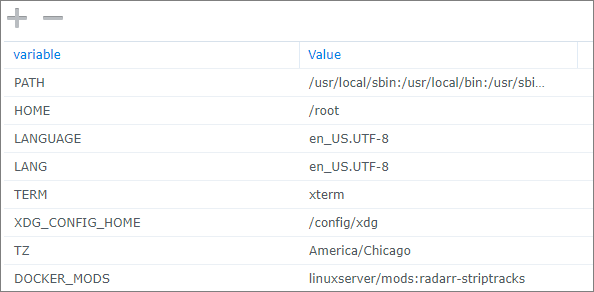
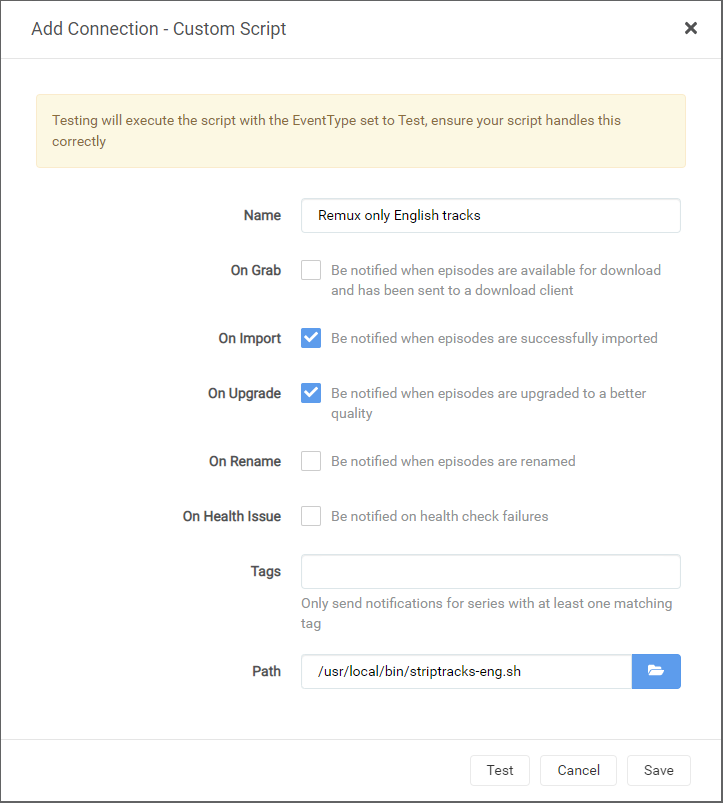
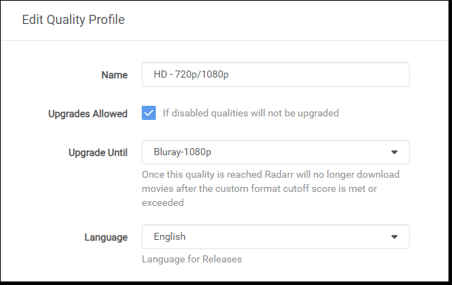
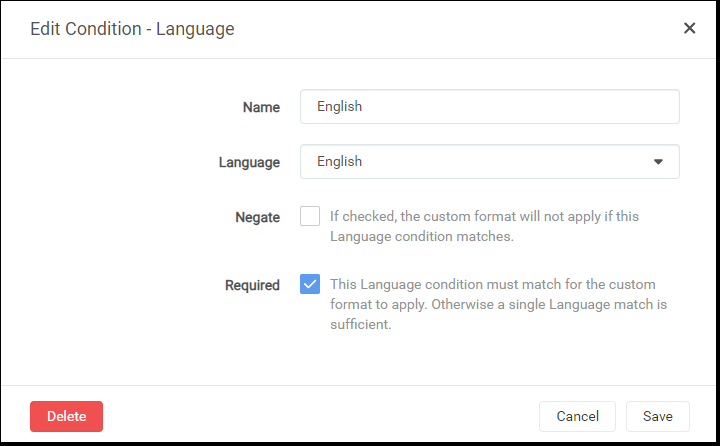
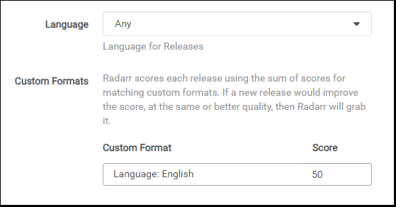
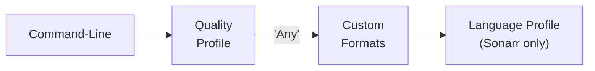
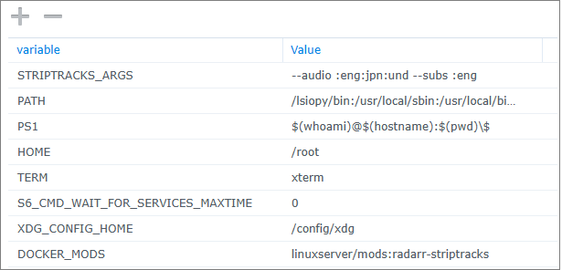

# About
A [Docker Mod](https://github.com/linuxserver/docker-mods) for the LinuxServer.io Radarr/Sonarr v3 or higher Docker containers that adds a script to automatically strip out unwanted audio and subtitle tracks, keeping only the desired languages.

**Beginning with version 2.0 of this mod, it only supports v3 or later of Radarr/Sonarr.  For legacy Radarr/Sonarr v2 please use mod release 1.3 or earlier**

**This unified script works in both Radarr and Sonarr.  Use this mod in either container!**
>**NOTE:** This mod supports Linux OSes only.

Production Container info: 
[%5D.pulls&label=ghcr%20pulls&color=1572A4)](https://github.com/linuxserver/docker-mods/pkgs/container/mods)  
Development Container info:


[](https://github.com/TheCaptain989/radarr-striptracks/actions/workflows/linter.yml "Linter Job")  

# Installation
1. Pull your selected container ([linuxserver/radarr](https://hub.docker.com/r/linuxserver/radarr "LinuxServer.io's Radarr container") or [linuxserver/sonarr](https://hub.docker.com/r/linuxserver/sonarr "LinuxServer.io's Sonarr container")) from GitHub Container Registry or Docker Hub:  
  `docker pull lscr.io/linuxserver/radarr:latest`   OR  
  `docker pull lscr.io/linuxserver/sonarr:latest`  

2. Configure the Docker container with all the port, volume, and environment settings from the *original container documentation* here:  
   **[linuxserver/radarr](https://hub.docker.com/r/linuxserver/radarr "Radarr Docker container")**  
   **[linuxserver/sonarr](https://hub.docker.com/r/linuxserver/sonarr "Sonarr Docker container")**
   1. Add the **DOCKER_MODS** environment variable to your `compose.yml` file or `docker run` command, as follows:  
      - Stable release: `DOCKER_MODS=linuxserver/mods:radarr-striptracks`
      - Dev/test release: `DOCKER_MODS=thecaptain989/radarr-striptracks:latest`

      *Example Docker Compose YAML Configuration*  

      ```yaml
      version: "2.1"
      services:
        radarr:
          image: lscr.io/linuxserver/radarr
          container_name: radarr
          environment:
            - PUID=1000
            - PGID=1000
            - TZ=America/Chicago
            - DOCKER_MODS=linuxserver/mods:radarr-striptracks
          volumes:
            - /path/to/data:/config
            - /path/to/movies:/movies
            - /path/to/downloadclient-downloads:/downloads
          ports:
            - 7878:7878
          restart: unless-stopped
      ```  

      *Example Docker Run Command*

       ```shell
       docker run -d \
         --name=radarr \
         -e PUID=1000 \
         -e PGID=1000 \
         -e TZ=America/Chicago \
         -e DOCKER_MODS=linuxserver/mods:radarr-striptracks \
         -p 7878:7878 \
         -v /path/to/data:/config \
         -v /path/to/movies:/movies \
         -v /path/to/downloadclient-downloads:/downloads \
         --restart unless-stopped \
         lscr.io/linuxserver/radarr
       ```  

      *Example Synology Configuration*  
      

   2. Start the container.

3. Configure a custom script from Radarr's or Sonarr's *Settings* > *Connect* screen and type the following in the **Path** field:  
   `/usr/local/bin/striptracks.sh`  

   *Example*  
   

   The script will detect the language(s) defined in Radarr/Sonarr for the movie or TV show and only keep the audio and subtitles selected.  
   Alternatively, a wrapper script or an environment variable may be used to more granularly define which tracks to keep.  See [Wrapper Scripts](./README.md#wrapper-scripts) or [Environment Variable](./README.md#environment-variable) for more details.

# Usage
The source video can be any mkvtoolnix supported video format. The output is an MKV file with the same name and the same permissions. Owner is preserved if the script is executed as root.  
Chapters, if they exist, are preserved. The Title attribute in the MKV is set to the movie title plus year  
(ex: `The Sting (1973)`) or the series title plus episode information (ex: `Happy! 01x01 - What Smiles Are For`).  
The language of the video file will be updated in the Radarr or Sonarr database to reflect the actual languages preserved in the remuxed video, and the video will be renamed according to the Radarr/Sonarr rules if needed (for example, if a removed track would trigger a name change.)

If you've configured the Radarr/Sonarr **Recycle Bin** path correctly, the original video will be moved there.  
![danger] **NOTE:** If you have *not* configured the Recycle Bin, the original video file will be deleted/overwritten and permanently lost.

If the resulting video file would contain the same tracks as the original, and it's already an MKV, the remux step is skipped.

## Automatic Language Detection
Beginning with version 2.0 of this mod, the script may be called with no arguments.  It will detect the language(s) configured within Radarr/Sonarr on the particular movie or TV show.
Language selection(s) may be configured in ***Quality Profiles*** (only in Radarr), ***Custom Formats*** (in Radarr v3 and higher and Sonarr v4 and higher), or ***Language Profiles*** (Sonarr v3). Example screenshots are below.

Both audio **and** subtitle tracks that match the configured language(s) are kept.

The language selection **'Original'** will use the language Radarr pulled from [The Movie Database](https://www.themoviedb.org/ "TMDB") or that Sonarr pulled from [The TVDB](https://www.thetvdb.com/ "TVDB") during its last refresh.
Selecting this language is functionally equivalent to calling the script with `--audio :org --subs :org` command-line options.  See [Original language code](./README.md#original-language-code) below for more details.

The language selection **'Unknown'** will match tracks with **no configured language** in the video file. Selecting this language is functionally equivalent to calling the script with `--audio :und --subs :und` command-line options. See [Unknown language code](./README.md#unknown-language-code) below for more details.

The Radarr language selection **'Any'** has two purposes:
   1) It will trigger a search of languages in ***Custom Formats***
   2) If none are found, it will preserve **all languages** in the video file. This is functionally equivalent to calling the script with `--audio :any --subs :any` command-line options. See [Any language code](./README.md#any-language-code) below for more details.

>**Note:** When using the *Custom Format* conditions and scoring to select languages you may not get the results you expect.
>This can be non-intuitive configuration, especially when using negative scoring and the 'Negate' option.
>The script does not care what custom format is *detected* (aka applied) by Radarr/Sonarr on the video file, only what the *scores* are in the *Quality Profile*.
>If you choose to use Custom Formats, it is **highly recommended** to first run the script with the debug option `-d`, perform some test downloads and script runs, and then examine your results and the script logs closely to be sure things are working the way you want them to.

*Radarr Quality Profile Example*  


*Custom Format Condition Example*  


*Radarr Custom Format Language Score Example*  


### Language Detection Precedence
The following chart represents the order of precedence that the script follows to decide which language(s) to select when there are multiple settings configured. Moving left to right, it will stop when it finds a configured language.



Descriptively, these steps are:
1. Command-line options (or environment variable) override all automatic language selection.
2. If there are no command-line options, the video's *Quality Profile* is examined for a language configuration (only supported in Radarr).
3. If there is no *Quality Profile* language **or** it is set to 'Any', then examine the *Custom Formats* and scores associated with the quality profile.  All language conditions with positive scores *and* negated conditions with negative score are selected.
4. If the *Custom Format* scores are zero (0) or there are none with configured language conditions, examine the *Language Profile* (only supported in Sonarr v3)

>**Note:** For step 3 above, using *Custom Formats* when 'Any' is in the *Quality Profile* is consistent with the behavior described in [TRaSH Guides](https://trash-guides.info/Sonarr/Tips/How-to-setup-language-custom-formats/ "TraSH Guides: How to setup Language Custom Formats").

## Command-Line Syntax

### Options and Arguments
The script also supports command-line arguments that will override the automatic language detection.  More granular control can therefore be exerted or extended using tagging and defining multiple *Connect* scripts (this is native Radarr/Sonarr functionality outside the scope of this documentation).

The syntax for the command-line is:  
`striptracks.sh [{-a|--audio} <audio_languages> [{-s|--subs} <subtitle_languages>] [{-f|--file} <video_file>]] [{-l,--log} <log_file>] [{-d|--debug} [<level>]]`  

Where:

Option|Argument|Description
---|---|---
-a, --audio|<audio_languages>|Audio languages to keep<br/>ISO 639-2 code(s) prefixed with a colon (`:`)
-s, --subs|<subtitle_languages>|Subtitle languages to keep<br/>ISO 639-2 code(s) prefixed with a colon (`:`)
-f, --file|<video_file>|If included, the script enters **[Batch Mode](./README.md#batch-mode)** and converts the specified video file.<br/>Requires the `-a` option.<br/>![danger] **WARNING:** Do not use this argument when called from Radarr or Sonarr!
-l, --log|\<log_file\>|The log filename<br/>Default of /config/log/striptracks.txt
-d, --debug|\[\<level\>\]|Enables debug logging. Level is optional.<br/>Default of 1 (low)<br/>2 includes JSON output<br/>3 contains even more JSON output
--help| |Display help and exit.
--version| |Display version and exit.

The `<audio_languages>` and `<subtitle_languages>` are optional arguments that are colon (`:`) prepended language codes in [ISO 639-2](https://en.wikipedia.org/wiki/List_of_ISO_639-2_codes "List of ISO 639-2 codes") format.  
For example:

* `:eng`
* `:fre`
* `:spa`

...etc.

Multiple codes may be concatenated, such as `:eng:spa` for both English and Spanish.  Order is unimportant.

>![warning] **NOTE:** If no subtitle language is detected via Radarr/Sonarr configuration or specified on the command-line, all subtitles are removed.

### Any language code
The `:any` language code is a special code. When used, the script will preserve all language tracks, regardless of how they are tagged in the source video.

### Original language code
The `:org` language code is a special code. When used, instead of retaining a specific language, the script substitutes the original movie or TV show language as specified in its [The Movie Database](https://www.themoviedb.org/ "TMDB") or [The TVDB](https://www.thetvdb.com/ "TVDB") entry.  
As an example, when importing "*Amores Perros (2000)*" with options `--audio :org:eng`, the Spanish and English audio tracks are preserved.  
Several [Included Wrapper Scripts](./README.md#included-wrapper-scripts) use this special code.

>![danger] **NOTE:** This feature relies on the 'originalLanguage' field in the Radarr/Sonarr database. The `:org` code is therefore invalid when used in Batch Mode.  
> The script will log a warning if it detects the use of `:org` in an invalid way, though it will continue to execute.

### Unknown language code
The `:und` language code is a special code. When used, the script will match on any track that has a null or blank language attribute. If not included, tracks with no language attribute will be removed.  
>![danger] **NOTE:** It is common for M2TS and AVI files to have tracks with unknown languages! It is strongly recommended to include `:und` in most instances unless you know exactly what you're doing.

## Special Handling of Audio
The script is smart enough to not remove the last audio track. There is in fact no way to force the script to remove all audio. This way you don't have to specify every possible language if you are importing a foreign film, for example.

Additionally, two ISO 639-2 language codes are handled specially: the "*Uncoded languages*" code of `mis` and the "*No linguistic content*" code of `zxx`.  
Tracks with either of these codes are always retained as they are often used for instrumental tracks in silent films.  
There is no way to force the script to remove audio tracks with these codes.

## Examples

```shell
-d 2                              # Enable debugging level 2, audio and subtitles
                                  # languages detected from Radarr/Sonarr
-a :eng:und -s :eng               # Keep English and Unknown audio, and English subtitles
-a :org:eng -s :eng               # Keep English and Original audio, and English subtitles
:eng ""                           # Keep English audio and remove all subtitles
-d -a :eng:kor:jpn -s :eng:spa    # Enable debugging level 1, keeping English, Korean, and Japanese audio, and
                                  # English and Spanish subtitles
-f "/path/to/movies/Finding Nemo (2003).mkv" -a :eng:und -s :eng
                                  # Batch Mode
                                  # Keep English and Unknown audio and English subtitles, converting
                                  # video specified
-a :any -s ""                     # Keep all audio and remove all subtitles
```

## Wrapper Scripts
To supply arguments to the script, you must either use one of the included wrapper scripts, create a custom wrapper script, or set the `STRIPTRACKS_ARGS` [environment variable](./README.md#environment-variable).

### Included Wrapper Scripts
For your convenience, several wrapper scripts are included in the `/usr/local/bin/` directory.  
You may use any of these scripts in place of `striptracks.sh` mentioned in the [Installation](./README.md#installation) section above.

```shell
striptracks-debug.sh       # Use detected languages, but enable debug logging
striptracks-debug-2.sh     # Use detected languages, enable debug logging level 2
striptracks-debug-max.sh   # Use detected languages, enable highest debug logging
striptracks-dut.sh         # Keep Dutch audio and subtitles
striptracks-eng.sh         # Keep English and Unknown audio, and English subtitles
striptracks-eng-debug.sh   # Keep English and Unknown audio, and English subtitles, and enable debug logging
striptracks-eng-fre.sh     # Keep English, French, and Unknown audio and English subtitles
striptracks-eng-jpn.sh     # Keep English, Japanese, and Unknown audio and English subtitles
striptracks-fre.sh         # Keep French audio and subtitles
striptracks-fre-debug.sh   # Keep French audio and subtitles, and enable debug logging
striptracks-ger.sh         # Keep German audio and subtitles
striptracks-spa.sh         # Keep Spanish audio and subtitles
striptracks-org-eng.sh     # Keep Original, English, and Unknown audio, and English and Unknown subtitles
striptracks-org-ger.sh     # Keep Original and German audio, and Original and German subtitles
striptracks-org-spa.sh     # Keep Original and Spanish audio, and Original and Spanish subtitles
```

### Example Wrapper Script
To configure an entry from the [Examples](./README.md#examples) section above, create and save a file called `striptracks-custom.sh` to `/config` containing the following text:

```shell
#!/bin/bash

. /usr/local/bin/striptracks.sh -d -a :eng:kor:jpn -s :eng:spa
```

Make it executable:

```shell
chmod +x /config/striptracks-custom.sh
```

Then put `/config/striptracks-custom.sh` in the **Path** field in place of `/usr/local/bin/striptracks.sh` mentioned in the [Installation](./README.md#installation) section above.

>**Note:** If you followed the Linuxserver.io recommendations when configuring your container, the `/config` directory will be mapped to an external storage location.  It is therefore recommended to place custom scripts in the `/config` directory so they will survive container updates, but they may be placed anywhere that is accessible by Radarr or Sonarr.

## Environment Variable
The `striptracks.sh` script also allows the use of arguments provided by the `STRIPTRACKS_ARGS` environment variable. This allows advanced use cases without having to provide a custom script.

For example, the following value in your `docker run` command would Keep English, Japanese, and Unknown audio and English subtitles:

```shell
-e STRIPTRACKS_ARGS='--audio :eng:jpn:und --subs :eng'
```

In Docker Compose this will look like this:

```yaml
environment:
  - STRIPTRACKS_ARGS=--audio :eng:jpn:und --subs :eng
```

*Example Synology Configuration*  


>**NOTE:** The environment variable settings are *only* used when **no** command-line arguments are present. **Any** command-line argument will disable the use of the environment variable.

## Triggers
The only events/notification triggers that are supported are **On Import** and **On Upgrade**

## Batch Mode
Batch mode allows the script to be executed independently of Radarr or Sonarr.  It converts the file specified on the command-line and ignores any environment variables that are normally expected to be set by the video management program.

Using this function, you can easily process all of your video files in any subdirectory at once.  See the [Batch Example](./README.md#batch-example) below.

### Script Execution Differences in Batch Mode
Because the script is not called from within Radarr or Sonarr, expect the following behavior while in Batch Mode:
* *The filename must be specified on the command-line.*<br/>(The `-f` option places the script in Batch Mode)
* *No audio or subtitles language detection occurs.*<br/>Both the audio and subtitles languages must be specified on the command-line.
* *The `:org` language code is meaningless.*<br/>The original video language cannot be determined without the Radarr/Sonarr database.
* *The resultant MKV embedded title attribute is set to the basename of the file minus the extension.*<br/>The canonical name of the movie/TV show cannot otherwise be determined.
* *Radarr or Sonarr APIs are not called and their database is not updated.*<br/>This may require a manual rescan of converted videos.
* *Original video files are deleted.*<br/>The Recycle Bin function is not available.

### Batch Example
To keep English and Unknown audio and English subtitles on all video files ending in .MKV, .AVI, or .MP4 in the `/movies` directory, enter the following at the Linux command-line:

```shell
find /movies/ -type f \( -name "*.mkv" -o -name "*.avi" -o -name "*.mp4" \) | while read file; do /usr/local/bin/striptracks.sh -f "$file" -a :eng:und -s :eng; done
```

## Logs
By default, a log file is created for the script activity called:

`/config/logs/striptracks.txt`

This log can be inspected or downloaded from Radarr/Sonarr under *System* > *Logs* > *Files*.  The log filename can be modified with the `--log` command-line option.

Script errors will show up in both the script log and the native Radarr/Sonarr log.

Log rotation is performed with 5 log files of 512KB each being kept.  
>![danger] **NOTE:** If debug logging is enabled with a level above 1, the log file can grow very large very quickly.  *Do not leave high-level debug logging enabled permanently.*

# Uninstall
To completely remove the mod:
1. Delete the custom script from Radarr's or Sonarr's *Settings* > *Connect* screen that you created in the [Installation](./README.md#installation) section above.
2. Stop and delete the Radarr/Sonarr container.
3. Remove the **DOCKER_MODS** environment variable from your `compose.yaml` file or exclude it from the `docker run` command when re-creating the Radarr/Sonarr container.

___

# Credits

This would not be possible without the following:

[Radarr](http://radarr.video/ "Radarr homepage")  
[Sonarr](http://sonarr.tv/ "Sonarr homepage")  
[LinuxServer.io Radarr](https://hub.docker.com/r/linuxserver/radarr "Radarr Docker container") container  
[LinuxServer.io Sonarr](https://hub.docker.com/r/linuxserver/sonarr "Sonarr Docker container") container  
[LinuxServer.io Docker Mods](https://hub.docker.com/r/linuxserver/mods "Docker Mods containers") project  
[MKVToolNix](https://mkvtoolnix.download/ "MKVToolNix homepage") by Moritz Bunkus  
The AWK script parsing mkvmerge output is adapted from Endoro's post on [VideoHelp](https://forum.videohelp.com/threads/343271-BULK-remove-non-English-tracks-from-MKV-container#post2292889).  
Icons made by [Freepik](https://www.freepik.com) from [Flaticon](https://www.flaticon.com/)

[warning]: .assets/warning.png "Warning"
[danger]: .assets/danger.png "Danger"
