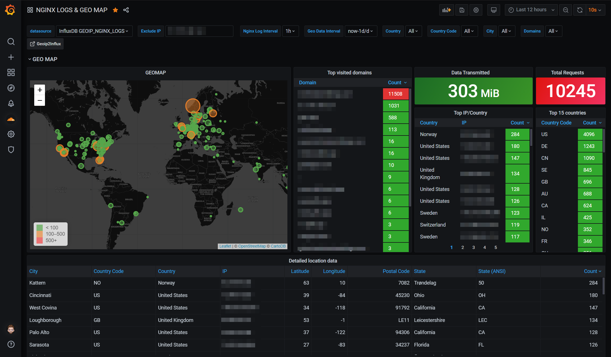

# Geoip2Influx - Docker mod for nginx/swag


This mod adds a python script that sends geo location metrics from the nginx access log to InfluxDB




The mod will parse the access log for IPs and and convert them into geo metrics for InfluxDB. It will also send log metrics if enabled.

Add `-e DOCKER_MODS=linuxserver/mods:swag-geoip2influx`

## Enviroment variables:

These are the **default** values for all envs. 
Add the ones that differ on your system. 

| Environment Variable | Example Value | Description |
| -------------------- | ------------- | ----------- |
| NGINX_LOG_PATH | /config/log/nginx/access.log | Optional, defaults to the example. |
| INFLUX_HOST | localhost | Host running InfluxDB. |
| INFLUX_HOST_PORT | 8086 | Optional, defaults to 8086. |
| INFLUX_DATABASE | geoip2influx | Optional, defaults to geoip2influx. |
| INFLUX_USER | root | Optional, defaults to root. |
| INFLUX_PASS | root | Optional, defaults to root. |
| GEO_MEASUREMENT | geoip2influx | Optional, InfluxDB measurement name for geohashes. Defaults to the example. |
| LOG_MEASUREMENT | nginx_access_logs | Optional, InfluxDB measurement name for nginx logs. Defaults to the example. |
| SEND_NGINX_LOGS | true | Optional, set to `false` to disable nginx logs. Defaults to `true`. |
| GEOIP2INFLUX_LOG_LEVEL | info | Optional. Sets the log level in geoip2influx.log. Use `debug` for verbose logging Optional, defaults to info. |
| INFLUX_RETENTION | 7d | Optional. Sets the retention for the database. Defaults to example.|
| INFLUX_SHARD | 1d | Optional. Set the shard for the database. Defaults to example. |
| MAXMINDDB_LICENSE_KEY | xxxxxxx | Add your Maxmind licence key |

***
### MaxMind Geolite2

Default download location is `/config/geoip2db/GeoLite2-City.mmdb`

Get your licence key here: https://www.maxmind.com/en/geolite2/signup

### InfluxDB 

#### InfluxDB v2.x is not supported. Use v1.8.x. 

The InfluxDB database will be created automatically with the name you choose.

***

## Grafana dashboard: 
### [Grafana Dashboard Link](https://grafana.com/grafana/dashboards/12268/)

***

## Sending Nginx log metrics

1. Uncomment the Geoip2 config in `nginx.conf`

2. Add the following to the http block in your `nginx.conf`file:

```nginx
log_format geoip2influx '$remote_addr - $remote_user [$time_local]'
           '"$request" $status $body_bytes_sent'
           '"$http_referer" $host "$http_user_agent"'
           '"$request_time" "$upstream_connect_time"'
           '"$geoip2_data_city_name" "$geoip2_data_country_iso_code"';
 ```
 
 3. Set the access log use the `geoip2influx` log format.
 
 Note: The log_format block must be above the access_log context. 
 ```nginx
 access_log /config/log/nginx/access.log geoip2influx;
 ```

### Multiple log files

If you separate your nginx log files but want this mod to parse all of them you can do the following:

As nginx can have multiple `access log` directives in a block, just add another one in the server block. 

**Example**

```nginx
	access_log /config/log/nginx/technicalramblings/access.log;
	access_log /config/log/nginx/access.log geoip2influx;
```
This will log the same lines to both files.

Then use the `/config/log/nginx/access.log` file in the `NGINX_LOG_PATH` variable. 
