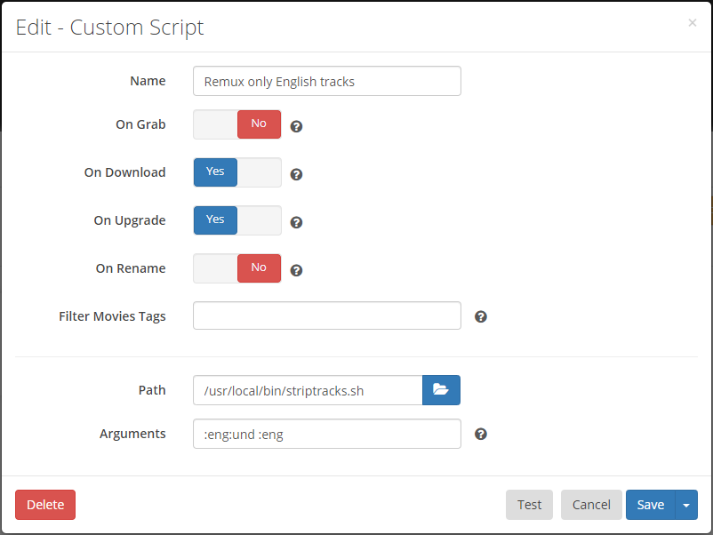

# About
A [Docker Mod](https://github.com/linuxserver/docker-mods) for the LinuxServer.io Radarr/Sonarr Docker container that adds a script to automatically strip out unwanted audio and subtitle streams, keeping only the desired languages.

**One unified script works in both Radarr and Sonarr.  Use this mod in either container!**
>**NOTE:** This mod supports Linux OSes only.

Container info:

  
Production Container info: 

# Installation
>**NOTE:** See the [Sonarr/Radarr v2 Builds](./README.md#sonarrradarr-v2-builds) section below for important differences to these instructions for v2 builds.  

1. Pull your selected container ([linuxserver/radarr](https://hub.docker.com/r/linuxserver/radarr "LinuxServer.io's Radarr container") or [linuxserver/sonarr](https://hub.docker.com/r/linuxserver/sonarr "LinuxServer.io's Sonarr container")) from Docker Hub:  
  `docker pull linuxserver/radarr:latest`   OR  
  `docker pull linuxserver/sonarr:latest`   

2. Configure the Docker container with all the port, volume, and environment settings from the *original container documentation* here:  
   **[linuxserver/radarr](https://hub.docker.com/r/linuxserver/radarr "Radarr Docker container")**  
   **[linuxserver/sonarr](https://hub.docker.com/r/linuxserver/sonarr "Sonarr Docker container")**
   1. Add the **DOCKER_MODS** environment variable to the `docker run` command, as follows:  
      - Dev/test release: `-e DOCKER_MODS=thecaptain989/radarr-striptracks:latest`  
      - Stable release: `-e DOCKER_MODS=linuxserver/mods:radarr-striptracks`

      *Example Docker CLI Configuration*  
       ```shell
       docker run -d \
         --name=radarr \
         -e PUID=1000 \
         -e PGID=1000 \
         -e TZ=America/Chicago \
         -e DOCKER_MODS=linuxserver/mods:radarr-striptracks \
         -p 7878:7878 \
         -v /path/to/data:/config \
         -v /path/to/movies:/movies \
         -v /path/to/downloadclient-downloads:/downloads \
         --restart unless-stopped \
         ghcr.io/linuxserver/radarr
       ```   

      *Example Synology Configuration*  
      

   2. Start the container.

3. After the above configuration is complete, to use mkvmerge, configure a custom script from Radarr's or Sonarr's *Settings* > *Connect* screen and type the following in the **Path** field:  
   `/usr/local/bin/striptracks-eng.sh`  

   *Example*  
   

   <ins>This is a wrapper script that calls striptracks.sh with the following arguments, which keep English audio and subtitles only!</ins>  
   `:eng:und :eng`

   *For any other combinations of audio and subtitles you **must** either use one of the [included wrapper scripts](./README.md#included-wrapper-scripts) or create a custom script with the codes for the languages you want to keep.  See the [Syntax](./README.md#syntax) section below.*  
   *Do not put `striptracks.sh` in the **Path** field!*

## Usage
The source video can be any mkvtoolnix supported video format. The output is an MKV file with the same name.  
Chapters, if they exist, are preserved. The Title attribute in the MKV is set to the movie title plus year  
(ex: `The Sting (1973)`) or the series title plus episode information (ex: `Happy! 01x01 - What Smiles Are For`).

If you've configured the Radarr/Sonarr **Recycle Bin** path correctly, the original video will be moved there.  
![danger] **NOTE:** If you have *not* configured the Recycle Bin, the original video file will be deleted/overwritten and permanently lost.

### Syntax
>**NOTE:** The **Arguments** field for Custom Scripts was removed in Radarr and Sonarr v3 due to security concerns. To support options with these versions and later,
a wrapper script must be manually created that will call *striptracks.sh* with the required arguments.

The script accepts two command line arguments and one option:

`[-d] <audio_languages> <subtitle_languages>`

The `<audio_languages>` and `<subtitle_languages>` arguments are colon (:) prepended language codes in [ISO639-2](https://en.wikipedia.org/wiki/List_of_ISO_639-2_codes "List of ISO 639-2 codes") format.  
For example:

* :eng
* :fre
* :spa

...etc.

Multiple codes may be concatenated, such as `:eng:spa` for both English and Spanish.  
**These codes are mandatory.** There are no defaults.

The wrapper script noted above uses `:eng:und :eng`, which will keep English and Undetermined audio and English subtitles.
>**NOTE:** The script is smart enough to not remove the last audio track. This way you don't have to specify every possible language if you are importing a
foreign film, for example.

The `-d` option enables debug logging.

### Examples
```
:eng:und :eng            # keep English and Undetermined audio and English subtitles
-d :eng ""               # Enable debugging, keeping English audio and no subtitles
:eng:kor:jpn :eng:spa    # Keep English, Korean, and Japanese audio, and English and
                         # Spanish subtitles
```

### Included Wrapper Scripts
For your convenience, several wrapper scripts are included in the `/usr/local/bin/` directory.  
You may use any of these scripts in place of the `striptracks-eng.sh` mentioned in the [Installation](./README.md#installation) section above.

```
striptracks-dut.sh         # Keep Dutch audio and subtitles
striptracks-eng.sh         # Keep English and Undetermined audio and English subtitles
striptracks-eng-debug.sh   # Keep English and Undetermined audio and English subtitles, and enable debug logging
striptracks-eng-fre.sh     # Keep English, French, and Undetermined audio and English subtitles
striptracks-eng-jpn.sh     # Keep English, Japanese, and Undetermined audio and English subtitles
striptracks-fre.sh         # Keep French audio and subtitles
striptracks-fre-debug.sh   # Keep French audio and subtitles, and enable debug logging
striptracks-ger.sh         # Keep German audio and subtitles
striptracks-spa.sh         # Keep Spanish audio and subtitles
```

### Example Wrapper Script
To configure the last entry from the [Examples](./README.md#examples) section above, create and save a file called `striptracks-custom.sh` to `/config` containing the following text:
```shell
#!/bin/bash

. /usr/local/bin/striptracks.sh :eng:kor:jpn :eng:spa
```
Make it executable:
```shell
chmod +x /config/striptracks-custom.sh
```

Then put `/config/striptracks-custom.sh` in the **Path** field in place of `/usr/local/bin/striptracks-eng.sh` mentioned in the [Installation](./README.md#installation) section above.

>**Note:** If you followed the Linuxserver.io recommendations when configuring your container, the `/config` directory will be mapped to an external storage location.  It is therefore recommended to place custom scripts in the `/config` directory so they will survive container updates, but they may be placed anywhere that is accessible by Radarr or Sonarr.

### Triggers
The only events/notification triggers that have been tested are **On Import** and **On Upgrade**

### Logs
A log file is created for the script activity called:

`/config/logs/striptracks.txt`

This log can be inspected or downloaded from Radarr/Sonarr under *System* > *Logs* > *Files*

Script errors will show up in both the script log and the native Radarr/Sonarr log.

Log rotation is performed with 5 log files of 512KB each being kept.  
>![danger] **NOTE:** If debug logging is enabled, the log file can grow very large very quickly.  *Do not leave debug logging enabled permanently.*

___

## Sonarr/Radarr v2 Builds
>![warning] **Warning: Legacy Releases**  
>The Sonarr/Radarr v2 Builds of Radarr and Sonarr are no longer being developed and are considered legacy. However, this mod works with all versions of the container.

<ins>Important differences for Sonarr/Radarr v2 Builds</ins>
### Legacy Installation
Substitute the following step for step #3 noted in the [Installation](./README.md#installation) section above.  
3. After all of the above configuration is complete, to use mkvmerge:  
   1. Configure a custom script from the Radarr/Sonnar *Settings* > *Connect* screen and type the following in the **Path** field:  
      `/usr/local/bin/striptracks.sh`  

   2. Add the codes for the audio and subtitle languages you want to keep as **Arguments** (details in the [Syntax](./README.md#syntax) section above):  
      <ins>Suggested Example</ins>  
      `:eng:und :eng`

   *Example*  
   

### Legacy Triggers
The only events/notification triggers that have been tested are **On Download** and **On Upgrade**

### Legacy Logs
The log can be inspected or downloaded from Radarr/Sonarr under *System* > *Log Files*

___

# Credits

This would not be possible without the following:

[Radarr](http://radarr.video/ "Radarr homepage")  
[Sonarr](http://sonarr.tv/ "Sonarr homepage")  
[LinuxServer.io Radarr](https://hub.docker.com/r/linuxserver/radarr "Radarr Docker container") container  
[LinuxServer.io Sonarr](https://hub.docker.com/r/linuxserver/sonarr "Sonarr Docker container") container  
[LinuxServer.io Docker Mods](https://hub.docker.com/r/linuxserver/mods "Docker Mods containers") project  
[MKVToolNix](https://mkvtoolnix.download/ "MKVToolNix homepage") by Moritz Bunkus  
The AWK script parsing mkvmerge output is adapted from Endoro's post on [VideoHelp](https://forum.videohelp.com/threads/343271-BULK-remove-non-English-tracks-from-MKV-container#post2292889).  
Icons made by [Freepik](https://www.freepik.com) from [Flaticon](https://www.flaticon.com/)

[warning]: .assets/warning.png "Warning"
[danger]: .assets/danger.png "Danger"
