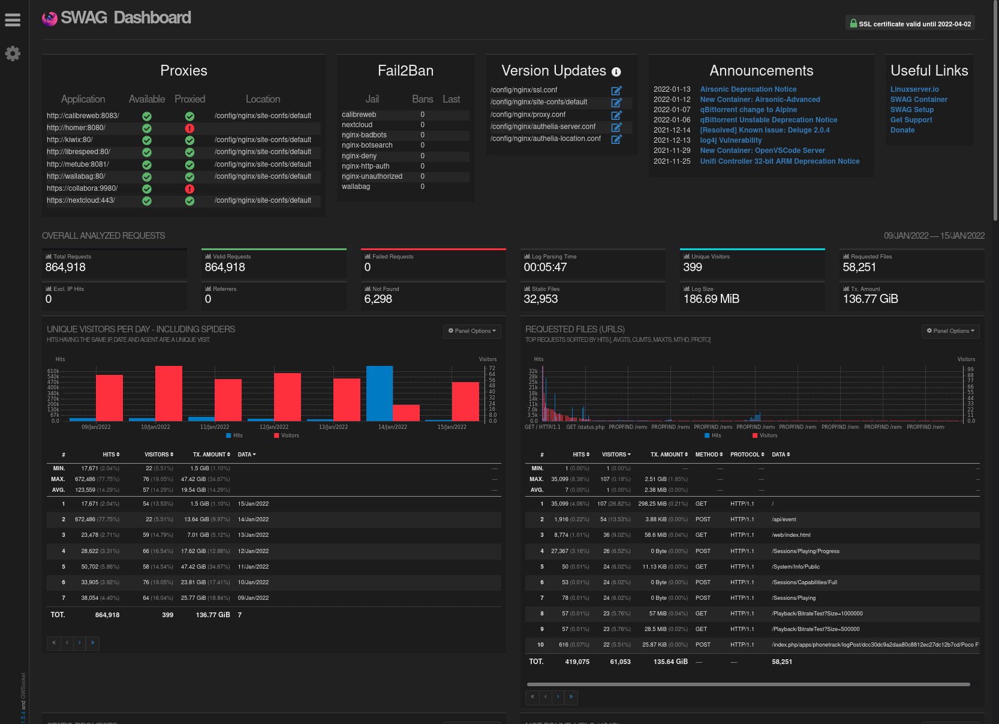

# Dashboard Docker mod for SWAG

This mod adds a dashboard to SWAG powered by [Goaccess](https://goaccess.io/).

# Enable

In the container's docker arguments, set an environment variable DOCKER_MODS=linuxserver/mods:swag-dashboard

If adding multiple mods, enter them in an array separated by |, such as DOCKER_MODS=linuxserver/mods:swag-dashboard|linuxserver/mods:swag-mod2

# Usage

Navigate to `dashboard.domain.com` from your LAN to view the dashboard
Note: The application discovery works best when the container names match the `proxy-conf` files

# Example

