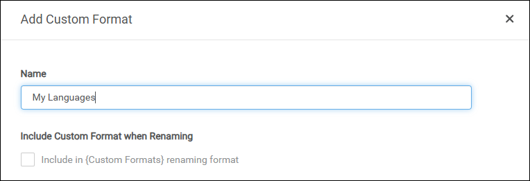
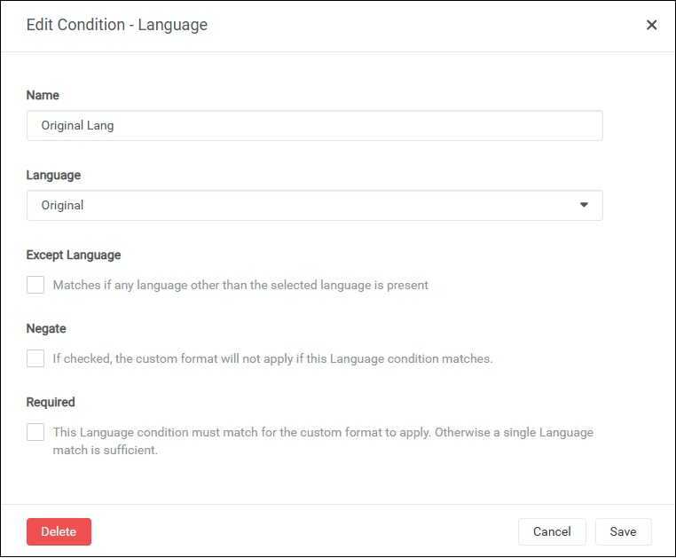
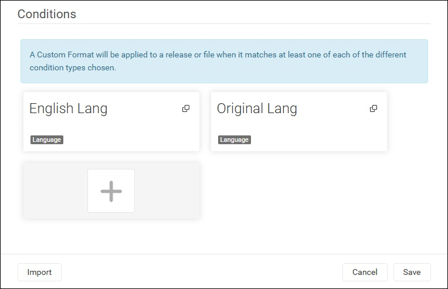
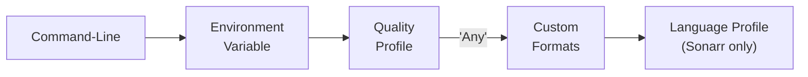

# About
A [Docker Mod](https://github.com/linuxserver/docker-mods) for the LinuxServer.io Radarr/Sonarr v3 or higher Docker containers that adds a script to automatically strip out unwanted audio and subtitle tracks, keeping only the desired languages. A [Batch Mode](#batch-mode) is also supported that allows usage outside of Radarr/Sonarr.

**This unified script works in both Radarr and Sonarr.  Use this mod in either container!**

> [!NOTE]
> This mod supports Linux OSes only.

<!-- markdownlint-disable -->
Production Container info: [](https://hub.docker.com/r/linuxserver/mods/tags?name=radarr-striptracks "Docker image size")
[](https://github.com/linuxserver/docker-mods/pkgs/container/mods "GitHub package pulls")  
Development Container info:
[](https://hub.docker.com/r/thecaptain989/radarr-striptracks "Docker image size")
[](https://hub.docker.com/r/thecaptain989/radarr-striptracks "Docker container pulls")
[](https://github.com/TheCaptain989/radarr-striptracks/actions/workflows/BuildImage.yml "BuildImage job")  
<!-- markdownlint-restore -->  

# Installation
1. Configure your selected Docker container with all the port, volume, and environment settings from the *original container documentation* here:  
   **[linuxserver/radarr](https://hub.docker.com/r/linuxserver/radarr "Radarr Docker container")**  OR  **[linuxserver/sonarr](https://hub.docker.com/r/linuxserver/sonarr "Sonarr Docker container")**
   1. Add the **DOCKER_MODS** environment variable to your `compose.yml` file or `docker run` command, as follows:  
      - Stable/Production release: `DOCKER_MODS=linuxserver/mods:radarr-striptracks`
      - Dev/test release: `DOCKER_MODS=thecaptain989/radarr-striptracks:latest`

      *Example Docker Compose YAML Configuration*

      ```yaml
      version: "2.1"
      services:
        radarr:
          image: lscr.io/linuxserver/radarr
          container_name: radarr
          environment:
            - PUID=1000
            - PGID=1000
            - TZ=America/Chicago
            - DOCKER_MODS=linuxserver/mods:radarr-striptracks
          volumes:
            - /path/to/data:/config
            - /path/to/movies:/movies
            - /path/to/downloadclient-downloads:/downloads
          ports:
            - 7878:7878
          restart: unless-stopped
      ```  

      <details>
      <summary>Example Docker Run Command</summary>

       ```shell
       docker run -d \
         --name=radarr \
         -e PUID=1000 \
         -e PGID=1000 \
         -e TZ=America/Chicago \
         -e DOCKER_MODS=linuxserver/mods:radarr-striptracks \
         -p 7878:7878 \
         -v /path/to/data:/config \
         -v /path/to/movies:/movies \
         -v /path/to/downloadclient-downloads:/downloads \
         --restart unless-stopped \
         lscr.io/linuxserver/radarr
       ```  

      </details>
      <details>
      <summary>Synology Screenshot</summary>

      *Example Synology Configuration*  
      

      </details>

   2. Start the container.

2. Configure a custom script from Radarr's or Sonarr's *Settings* > *Connect* screen and type the following in the **Path** field:  
   `/usr/local/bin/striptracks.sh`  

   <details>
   <summary>Screenshot</summary>

   *Example Custom Script*  
   

   </details>

   The script will detect the language(s) defined in Radarr/Sonarr for the movie or TV show and only keep the audio and subtitles selected.  
   Alternatively, a wrapper script or an environment variable may be used to more granularly define which tracks to keep.  See [Wrapper Scripts](#wrapper-scripts) or [Environment Variable](#environment-variable) for more details.

> [!IMPORTANT]
> You **must** configure language(s) in Radarr/Sonarr *or* pass command-line arguments for the script to do anything!  See the next section for an example.

## Radarr Configuration Example
The following is a simplified example and steps to configure Radarr so the script will keep Original and English languages of an imported movie.

1. Create a new *Custom Format* called "***My Languages***":

   <details>
   <summary>Screenshot</summary>

   *New Custom Format Example*  
   

   </details>

2. Add two *Language Conditions* to the format, one for English, and one for Original:

   <details>
   <summary>Screenshots</summary>

   *New Language Conditions Example*  
     

   *Custom Format Conditions Example*  
   

  </details>

3. Edit the 'Any' Quality Profile, changing the Language to "***Any***" and the *Score* to "***10***":

   <details>
   <summary>Screenshot</summary>

   *Radarr Quality Profile Example*  
   

   </details>

Now, when Radarr imports a movie with the 'Any' Quality Profile, the script will keep only Original and English languages.  This is equivalent to calling the script with `--audio :org:eng --subs :org:eng` command-line arguments.
See [Automatic Language Detection](#automatic-language-detection) for more details.

# Usage Details
The source video can be any mkvtoolnix supported video format. The output is an MKV file with the same name and the same permissions. Owner is preserved if the script is executed as root.  
Chapters, if they exist, are preserved. The Title attribute in the MKV is set to the movie title plus year  
(ex: `The Sting (1973)`) or the series title plus episode information (ex: `Happy! 01x01 - What Smiles Are For`).  
The language of the video file will be updated in the Radarr or Sonarr database to reflect the actual languages preserved in the remuxed video, and the video will be renamed according to the Radarr/Sonarr rules if needed (for example, if a removed track would trigger a name change.)

If the resulting video file would contain the same tracks as the original, and it's already an MKV, the remux step is skipped.

> [!TIP]
> If you've configured the Radarr/Sonarr **Recycle Bin** path correctly, the original video will be moved there unless disabled with the `--disable-recycle` option.  

> [!CAUTION]
> If you have ***not*** configured the Recycle Bin, the original video file will be deleted/overwritten and permanently lost.

## Automatic Language Detection
When the script is called with no arguments, it will attempt to detect the language(s) configured within Radarr/Sonarr on the particular movie or TV show.  
Language selection(s) may be configured in:
- ***Custom Formats*** (in Radarr v3 and higher and Sonarr v4 and higher),
- ***Quality Profiles*** (only in Radarr), or
- ***Language Profiles*** (Sonarr v3)

Both audio **and** subtitle tracks that match the configured language(s) are kept.

> [!TIP]
> It is **highly recommended** to review the [TraSH Guides](https://trash-guides.info/Radarr/Tips/How-to-setup-language-custom-formats/) setup instructions for Language Custom Formats.

### Special Language Selections
The language selection **'Original'** will use the language Radarr pulled from [The Movie Database](https://www.themoviedb.org/ "TMDB") or that Sonarr pulled from [The TVDB](https://www.thetvdb.com/ "TVDB") during its last refresh.
Selecting this language is functionally equivalent to calling the script with `--audio :org --subs :org` command-line arguments.  See [Original language code](#original-language-code) below for more details.

The language selection **'Unknown'** will match tracks with **no configured language** in the video file. Selecting this language is functionally equivalent to calling the script with `--audio :und --subs :und` command-line arguments.
See [Unknown language code](#unknown-language-code) below for more details.

The language selection **'Any'** has two purposes:
   1) In Radarr only, when set on a Quality Profile, it will trigger a search of languages in ***Custom Formats***
   2) If languages are not configured in a Custom Format, or if you're using Sonarr, it will preserve **all languages** in the video file. This is functionally equivalent to calling the script with `--audio :any --subs :any` command-line arguments.
   See [Any language code](#any-language-code) below for more details.

> [!IMPORTANT]
> When using *Custom Formats* language conditions and scoring you may not get the results you expect.
> This can be non-intuitive configuration, especially when using negative scoring, the 'Negate' option, and the 'Except Language' option.
> The script does not care what custom format is *applied* by Radarr/Sonarr on the video file, only what the custom format conditions are and the *scores* are in the corresponding *Quality Profile*.
> If you choose to use Custom Formats, it is **highly recommended** to first run the script with the debug option `-d`, perform some test downloads and script runs, and then examine your results and the script logs closely to be sure things are working the way you want them to.

### Language Detection Precedence
The following chart represents the order of precedence that the script uses to decide which language(s) to select when there are multiple settings configured. Moving left to right, it will stop when it finds a configured language.



Descriptively, these steps are:
1. Command-line arguments override all automatic language selection.
2. Environment variable is checked for arguments.
3. If there are no command-line or environment variable arguments, the video's *Quality Profile* is examined for a language configuration (only supported in Radarr).
4. If there is no *Quality Profile* language **or** it is set to 'Any', then examine the *Custom Formats* and scores associated with the quality profile.  
All language conditions with positive scores *and* Negated conditions with negative scores *and* non-Negated Except Language conditions with negative scores are selected.
5. If the *Custom Format* scores are zero (0) or there are none with configured language conditions, use the *Language Profile* (only supported in Sonarr v3)

> [!NOTE]
> For step 4 above, using *Custom Formats* when 'Any' is in the *Quality Profile* is consistent with the behavior described in [TRaSH Guides](https://trash-guides.info/Radarr/Tips/How-to-setup-language-custom-formats/ "TraSH Guides: How to setup Language Custom Formats").

## Command-Line Syntax

### Options and Arguments
The script also supports command-line arguments that will override the automatic language detection.  More granular control can therefore be exerted or extended using tagging and defining multiple *Connect* scripts (this is native Radarr/Sonarr functionality outside the scope of this documentation).

The syntax for the command-line is:  
`striptracks.sh [{-a|--audio} <audio_languages> [{-s|--subs} <subtitle_languages>] [{-f|--file} <video_file>]] [--reorder] [--disable-recycle] [{-l|--log} <log_file>] [{-c|--config} <config_file>] [{-p|--priority} {idle|low|medium|high}] [{-d|--debug} [<level>]]`  

<details>
<summary>Table of Command-Line Arguments</summary>

Option|Argument|Description
---|---|---
`-a`, `--audio`|`<audio_languages>`|Audio languages to keep<br/>ISO 639-2 code(s) prefixed with a colon (`:`)<br/>Each code may optionally be followed by a plus (`+`) and one or more [modifiers](#language-code-modifiers).
`-s`, `--subs`|`<subtitle_languages>`|Subtitle languages to keep<br/>ISO 639-2 code(s) prefixed with a colon (`:`)<br/>Each code may optionally be followed by a plus (`+`) and one or more modifiers.
`-f`, `--file`|`<video_file>`|If included, the script enters **[Batch Mode](#batch-mode)** and converts the specified video file.<br/>Requires the `--audio` option.<br/>![notes] **Do not** use this argument when called from Radarr or Sonarr!
`--reorder`| |Reorder audio and subtitles tracks to match the language code order specified in the `<audio_languages>` and `<subtitle_languages>` arguments.
`--disable-recycle`| |Disable recycle bin use, even if configured in Radarr/Sonarr
`-l`, `--log`|`<log_file>`|The log filename<br/>Default is `/config/log/striptracks.txt`
`-c`, `--config`|`<config_file>`|Radarr/Sonarr XML configuration file<br/>Default is `/config/config.xml`
`-p`, `--priority`|`idle`, `low`, `medium`, `high`|CPU and I/O process priority for mkvmerge<br/>Default is `medium`<br/>![notes] High priority can consume all system resources. When processing a large video file your system may become unresponsive!
`-d`, `--debug`|`[<level>]`|Enables debug logging. Level is optional.<br/>Default is `1` (low)<br/>`2` includes JSON output<br/>`3` contains even more JSON output
`--help`| |Display help and exit.
`--version`| |Display version and exit.

</details>

The `<audio_languages>` and `<subtitle_languages>` arguments are colon (`:`) prepended language codes in [ISO 639-2](https://en.wikipedia.org/wiki/List_of_ISO_639-2_codes "List of ISO 639-2 codes") format.  
For example:

* `:eng`
* `:fre`
* `:spa`

...etc.

Multiple codes may be concatenated, such as `:eng:spa` for both English and Spanish.  Order is unimportant, unless the `--reorder` option is specified.

> [!WARNING]
> If no subtitle language is detected via Radarr/Sonarr configuration or specified on the command-line, all subtitles are removed.

### Language Code Modifiers
Each language code can optionally be followed by a plus (`+`) and one or more modifier characters.  Supported modifiers are:

Modifier|Function
---|---
`f`|Selects only tracks with the forced flag set
`d`|Selects only tracks with the default flag set
`[0-9]`|Specifies the maximum number of tracks to select.<br/>Based on the order of the tracks in the original source video.

These modifiers must be applied to each language code you want to modify.  They may be used with either audio or subtitles codes.  
For example, the following options, `--audio :org:any+d --subs :eng+1:any+f` would keep:  
- All original language audio tracks, and all Default audio tracks regardless of language
- One English language subtitles track, and all Forced subtitles tracks regardless of language

Modifiers may be combined, such as `:any+fd` to keep all forced and all default tracks, or `:eng+1d` to keep one default English track.

> [!NOTE]
> Note the exact phrasing of the previous sentence.  There is nuance here that is not obvious.  
> `:any+fd` is equivalent to `:any+f:any+d`, but `:eng+1d` is **not** the same as `:eng+1:eng+d`.

### Any language code
The `:any` language code is a special code. When used, the script will preserve all language tracks, regardless of how they are tagged in the source video.

### Original language code
The `:org` language code is a special code. When used, instead of retaining a specific language, the script substitutes the original movie or TV show language as specified in its [The Movie Database](https://www.themoviedb.org/ "TMDB") or [The TVDB](https://www.thetvdb.com/ "TVDB") entry.  
As an example, when importing "*Amores Perros (2000)*" with options `--audio :org:eng`, the Spanish and English audio tracks are preserved.  
Several [Included Wrapper Scripts](#included-wrapper-scripts) use this special code.

> [!NOTE]
> This feature relies on the 'originalLanguage' field in the Radarr/Sonarr database. The `:org` code is therefore invalid when used in Batch Mode.  
> The script will log a warning if it detects the use of `:org` in an invalid way, though it will continue to execute.

### Unknown language code
The `:und` language code is a special code. When used, the script will match on any track that has a null or blank language attribute. If not included, tracks with no language attribute will be removed.  
> [!TIP]
> It is common for M2TS and AVI files to have tracks with unknown languages! It is recommended to include `:und` in most instances unless you know exactly what you're doing.

### Reorder Option
The `--reorder` option uses the order the language codes are specified to re-order the tracks in the output MKV video file.  Video tracks are always first, followed by audio tracks, and then subtitles.  Track removals and preservations occur the way they normally would.

<details>
<summary>Reorder Example</summary>

For example, given a source video (w/original language of English) that has the following track order:

> Track ID:0 Type:video Name:null Lang:und Codec:AVC/H.264/MPEG-4p10 Default:true Forced:false  
> Track ID:1 Type:audio Name:French Lang:fre Codec:E-AC-3 Default:true Forced:false  
> Track ID:2 Type:audio Name:German Lang:deu Codec:AC-3 Default:false Forced:false  
> Track ID:3 Type:audio Name:English Lang:eng Codec:AC-3 Default:false Forced:false  
> Track ID:4 Type:subtitles Name:French Lang:fre Codec:SubRip/SRT Default:false Forced:false  
> Track ID:5 Type:subtitles Name:English Lang:eng Codec:SubRip/SRT Default:false Forced:false  

And using the command line:

```shell
/usr/local/bin/striptracks.sh --audio :org+1:eng+1:fre+1:und+1 --subs :eng+1:fre+1:spa+1 --reorder
```

Will create an MKV file with tracks:

> Track ID:0 Type:video Name:null Lang:und Codec:AVC/H.264/MPEG-4p10 Default:true Forced:false  
> Track ID:1 Type:audio Name:English Lang:eng Codec:AC-3 Default:false Forced:false  
> Track ID:2 Type:audio Name:French Lang:fre Codec:E-AC-3 Default:true Forced:false  
> Track ID:3 Type:subtitles Name:English Lang:eng Codec:SubRip/SRT Default:false Forced:false  
> Track ID:4 Type:subtitles Name:French Lang:fre Codec:SubRip/SRT Default:false Forced:false  

</details>

## Special Handling of Audio
The script is smart enough to not remove the last audio track. There is in fact no way to force the script to remove all audio. This way you don't have to specify every possible language if you are importing a foreign film, for example.

Additionally, two ISO 639-2 language codes are handled specially: the "*Uncoded languages*" code of `mis` and the "*No linguistic content*" code of `zxx`.  
Tracks with either of these codes are always retained as they are often used for instrumental tracks in silent films.  
There is no way to force the script to remove audio tracks with these codes.

## Examples

<details>
<summary>Command-line Examples</summary>

```shell
-d 2                              # Enable debugging level 2, audio and subtitles
                                  # languages detected from Radarr/Sonarr
-a :eng:und -s :eng               # Keep English and Unknown audio, and English subtitles
-a :org:eng -s :any+f:eng         # Keep English and Original audio, and all forced or English subtitles
-a :eng -s ""                     # Keep English audio and remove all subtitles
-a :any -s ""                     # Keep all audio and remove all subtitles
-d -a :eng:kor:jpn -s :eng:spa    # Enable debugging level 1, keeping English, Korean, and Japanese audio,
                                  # and English and Spanish subtitles
-f "/movies/Finding Nemo (2003).mkv" -a :eng:und -s :eng
                                  # Batch Mode
                                  # Keep English and Unknown audio and English subtitles, converting
                                  # video specified
--audio :org:any+d1 --subs :eng+1:any+f2
                                  # Keep Original audio and one default audio track regardless of language
                                  # (first audio track flagged as Default as it appears in the source file),
                                  # one English subtitles track and two forced subtitles regardless of
                                  # language (as they appear in the source file)
```

</details>

## Wrapper Scripts
To supply arguments to the script, you must either use one of the included wrapper scripts, create a custom wrapper script, or set the `STRIPTRACKS_ARGS` [environment variable](#environment-variable).

> [!TIP]
> If you followed the Linuxserver.io recommendations when configuring your container, the `/config` directory will be mapped to an external storage location.
> It is therefore recommended to place custom scripts in the `/config` directory so they will survive container updates, but they may be placed anywhere that is accessible by Radarr or Sonarr.

### Included Wrapper Scripts
For your convenience, several wrapper scripts are included in the `/usr/local/bin/` directory.  
You may use any of these in place of `striptracks.sh` mentioned in the [Installation](#installation) section above.

<details>
<summary>List of scripts</summary>

```shell
striptracks-debug.sh        # Use detected languages, but enable debug logging
striptracks-debug-2.sh      # Use detected languages, enable debug logging level 2
striptracks-debug-max.sh    # Use detected languages, enable highest debug logging
striptracks-dut.sh          # Keep Dutch and Unknown audio, and Dutch subtitles
striptracks-eng.sh          # Keep English and Unknown audio, and English subtitles
striptracks-eng-debug.sh    # Keep English and Unknown audio, and English subtitles, and enable debug logging
striptracks-eng-fre.sh      # Keep English, French, and Unknown audio, and English and French subtitles
striptracks-eng-jpn.sh      # Keep English, Japanese, and Unknown audio and English subtitles
striptracks-fre.sh          # Keep French and Unknown audio, and French subtitles
striptracks-ger.sh          # Keep German and Unknown audio, and German subtitles
striptracks-spa.sh          # Keep Spanish and Unknown audio, and Spanish subtitles
striptracks-low-priority.sh # Use detected languages, but execute mkvmerge with low CPU and I/O priority
striptracks-org-eng.sh      # Keep Original, English, and Unknown audio, and Original and English subtitles
striptracks-org-ger.sh      # Keep Original, German, and Unknown audio, and Original and German subtitles
striptracks-org-spa.sh      # Keep Original, Spanish, and Unknown audio, and Original and Spanish subtitles
```

</details>

### Example Wrapper Script
<details>
<summary>Example Script</summary>

To configure an entry from the [Examples](#examples) section above, create and save a file called `striptracks-custom.sh` to `/config` containing the following text:

```shell
#!/bin/bash

. /usr/local/bin/striptracks.sh -d -a :eng:kor:jpn -s :eng:spa
```

Make it executable:

```shell
chmod +x /config/striptracks-custom.sh
```

Then put `/config/striptracks-custom.sh` in the **Path** field in place of `/usr/local/bin/striptracks.sh` mentioned in the [Installation](#installation) section above.

</details>

## Environment Variable
The script can also read arguments from the `STRIPTRACKS_ARGS` environment variable. This allows advanced use cases without having to provide a custom wrapper script.

> [!NOTE]
> The environment variable is *only* used when **no** command-line arguments are present. **Any** command-line argument will disable the use of the environment variable.

<details>
<summary>Example Docker Compose</summary>

For example, the following lines in your `compose.yml` file would keep English, Japanese, and Unknown audio and English subtitles:

```yaml
environment:
  - STRIPTRACKS_ARGS=--audio :eng:jpn:und --subs :eng
```

</details>
<details>
<summary>Example Docker Run Command</summary>

In a `docker run` command, it would be:

```shell
-e STRIPTRACKS_ARGS='--audio :eng:jpn:und --subs :eng'
```

</details>

<details>
<summary>Synology Screenshot</summary>

*Example Synology Configuration*  


</details>

## Triggers
The only events/notification triggers that are supported are **On Import** and **On Upgrade**.  The script will log an error if executed by any other trigger.

## Batch Mode
Batch mode allows the script to be executed independently of Radarr or Sonarr.  It converts the file specified on the command-line and ignores any environment variables that are normally expected to be set by the video management program.

Using this function, you can easily process all of your video files in any subdirectory at once.  See the [Batch Example](#batch-example) below.

### Script Execution Differences in Batch Mode
Because the script is not called from within Radarr or Sonarr, their database is unavailable to the script.  Therefore, expect the following behavior while in Batch Mode:
* *The filename must be specified on the command-line.*<br/>The `-f` option places the script in Batch Mode
* *No audio or subtitles language detection occurs.*<br/>Both the audio and subtitles languages must be specified on the command-line.
* *The `:org` language code is meaningless.*<br/>The original video language cannot be determined.
* *The resultant MKV embedded title attribute is set to the basename of the file minus the extension.*<br/>The canonical name of the movie/TV show cannot otherwise be determined.
* *Radarr or Sonarr APIs are not called and their database is not updated.*<br/>This may require a manual rescan of converted videos.
* *Original video files are deleted.*<br/>The Recycle Bin function is not available.

### Batch Example
<details>
<summary>Batch Mode Example</summary>

To keep English and Unknown audio and English subtitles on all video files ending in .MKV, .AVI, or .MP4 in the `/movies` directory, enter the following at the Linux command-line:

```shell
find /movies/ -type f \( -name "*.mkv" -o -name "*.avi" -o -name "*.mp4" \) | while read file; do /usr/local/bin/striptracks.sh -f "$file" -a :eng:und -s :eng; done
```

Here's another example to keep English, Danish, Unknown languages, and all forced subtitles on all video files in your `./videos` directory (requires the `file` program; testable with `file -v`):

```shell
find ./videos/ -type f | while read filename; do if file -i "$filename" | grep -q video; then /usr/local/bin/striptracks.sh -f "$filename" --audio :eng:dan:und --subs :eng:dan:und:any+f; fi; done
```

</details>

## Logs
By default, a log file is created for the script activity called:

`/config/logs/striptracks.txt`

This log can be inspected or downloaded from Radarr/Sonarr under *System* > *Logs* > *Files*.  The log filename can be modified with the `--log` command-line option.

Script errors will show up in both the script log and the native Radarr/Sonarr log.

Log rotation is performed with 5 log files of 512KB each being kept.  
> [!CAUTION]
> If debug logging is enabled with a level above 1, the log file can grow very large very quickly.  *Do not leave high-level debug logging enabled permanently.*

# Limitations
It should be noted that this script's core functionality nulifies some of the benefits of [hardlinks](https://trash-guides.info/hardlinks/).
However, configuring hardlinks is still recommended.

<details>
<summary>Hardlink Limitations</summary>

*Radarr Hardlinks Configuration Screenshot*


Hardlinks are essentially multiple references to the *same file*.
The purpose of a hardlink is to:
- Allow instant file moves from the download client to Radarr or Sonarr
- Reduce duplicate storage space
- Allow torrent seeding after download

Because the script creates a brand-new video file that includes only the selected streams and deletes the original, a hardlink cannot be preserved.
Instant file moves from your download client will continue to work, but the new file will consume additional space, and the original file will be deleted (or unlinked) by
the script which could prevent torrent seeding.

The script will log a warning if it detects the input video is a hardlink.

Note that the script does not *always* create a new file.  If there are no streams removed, the original video file is not deleted and any hardlinks are preserved.
It is therefore still recommended to enable and use hardlinks in Radarr and Sonarr.

</details>

# Uninstall
To completely remove the mod:
1. Delete the custom script from Radarr's or Sonarr's *Settings* > *Connect* screen that you created in the [Installation](#installation) section above.
2. Stop and delete the Radarr/Sonarr container.
3. Remove the **DOCKER_MODS** environment variable from your `compose.yaml` file or exclude it from the `docker run` command when re-creating the Radarr/Sonarr container.

___

# Credits

This would not be possible without the following:

[Radarr](http://radarr.video/ "Radarr homepage")  
[Sonarr](http://sonarr.tv/ "Sonarr homepage")  
[LinuxServer.io Radarr](https://hub.docker.com/r/linuxserver/radarr "Radarr Docker container") container  
[LinuxServer.io Sonarr](https://hub.docker.com/r/linuxserver/sonarr "Sonarr Docker container") container  
[LinuxServer.io Docker Mods](https://hub.docker.com/r/linuxserver/mods "Docker Mods containers") project  
[MKVToolNix](https://mkvtoolnix.download/ "MKVToolNix homepage") by Moritz Bunkus  
Inspired by Endoro's post on [VideoHelp](https://forum.videohelp.com/threads/343271-BULK-remove-non-English-tracks-from-MKV-container#post2292889).  
Icons made by [Freepik](https://www.freepik.com) from [Flaticon](https://www.flaticon.com/)

## Legacy Change Notes
Beginning with version 2.0 of this mod, it only supports v3 or later of Radarr/Sonarr.  For legacy Radarr/Sonarr v2 please use mod release 1.3 or earlier.  
Version 2.0 of this mod introduced automatic language detection.

[notes]: .assets/notes.png "Note"
