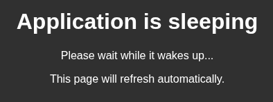

# On-demand - Docker mod for SWAG

This mod gives SWAG the ability to start containers on-demand when accessed through SWAG and stop them after a period of inactivity. It takes a few seconds for containers to start on-demand, you'll need to refresh the tab or add a loading page as detailed below.

## Setup:
- In SWAG's docker arguments, set an environment variable `DOCKER_MODS=linuxserver/mods:swag-ondemand` and either add a volume mapping for `/var/run/docker.sock:/var/run/docker.sock:ro`, or set an environment var `DOCKER_HOST=remoteaddress` (read the security considerations below).
- Add the label `swag_ondemand=enable` to on-demand containers.
    ```yaml
    somecontainer:
        container_name: somecontainer
        ...
        labels:
            - swag_ondemand=enable
    ```
- Replace the following line in `/config/nginx/nginx.conf`:
    ```nginx
    access_log /config/log/nginx/access.log;
    ```
    With:
    ```nginx
    log_format main '$remote_addr - $remote_user [$time_local] '
                    '"$request_method $scheme://$host$request_uri $server_protocol" '
                    '$status $body_bytes_sent '
                    '"$http_referer" "$http_user_agent"';
    access_log /config/log/nginx/access.log main;
    ```
- *Optional* - Additional environment variables
  - `SWAG_ONDEMAND_STOP_THRESHOLD` - duration of inactivity in seconds before stopping on-demand containers, defaults to `600` (10 minutes).
  - `SWAG_ONDEMAND_CONTAINER_QUERY_SLEEP` - sleep time in seconds between querying containers, defaults to `5.0`.
  - `SWAG_ONDEMAND_LOG_READER_SLEEP` - sleep time in seconds between log reads, defaults to `1.0`.
  - `SWAG_ONDEMAND_DOCKER_API_TIMEOUT` - the timeout for docker's API. Defaults to `5`.
  - `SWAG_ONDEMAND_REMOTE1` - the remote API of other hosts for ondemand to manage. For example: `tcp://otherhost:2375`.
  - `SWAG_ONDEMAND_REMOTE1_WOL_MAC` - Required for WoL, specifies which MAC address to send the WoL packet to. For example: `00:00:0A:BB:28:FC`.
  - `SWAG_ONDEMAND_REMOTE1_WOL_URLS` - Required for WoL, specifies which URL prefixes would trigger WoL. Same syntax as `swag_ondemand_urls` below. For example: `https://somecontainer.`.
  - `SWAG_ONDEMAND_REMOTE1_WOL_BROADCAST` - Optional, override which broadcast to send the WoL packet to. Defaults to `255.255.255.255`.
  - `SWAG_ONDEMAND_REMOTE1_WOL_PORT` - Optional, override which port to send the WoL packet to. Defaults to `9`.
  - `SWAG_ONDEMAND_REMOTE1_WOL_INTERFACE` - Optional, override which interface to use for sending the WoL packet. Defaults to the first interface.

**You can increment the number for up to 20 remote hosts. For example: `SWAG_ONDEMAND_REMOTE2`, `SWAG_ONDEMAND_REMOTE3`, etc.**

**For WoL to work in a container, you need to either set `network_mode: host` or broadcast to the IP of the remote host and set a static ARP on the router. For example: in opnsense add an entry under Interfaces > Neighbors > Static Assignments.**

### Loading Page:



Instead of showing a 502 error page, it can display a loading page and auto-refresh once the container is up.

Add the following `include` to each proxy-conf where you wish to show the loading page inside the `server` section:
```nginx
server {
    ...
    include /config/nginx/ondemand.conf;
    ...
```
Or set the following label if using `swag-auto-proxy`:
```yaml
    somecontainer:
        container_name: somecontainer
        ...
        labels:
            - 'swag_server_custom_directive=include /config/nginx/ondemand.conf;'
```
#### Authelia
Add the following line to each proxy-conf where you wish to show the loading page inside the `location` section:
```nginx
    location / {
        ...
        error_page 502 = @waking_up;
        ...
```
Or set the following label if using `swag-auto-proxy`:
```yaml
    somecontainer:
        container_name: somecontainer
        ...
        labels:
            - 'swag_location_custom_directive=error_page 502 = @waking_up;'
```
### Labels:
- `swag_ondemand=enable` - required for on-demand.
- `swag_ondemand_urls=https://wake.domain.com,https://app.domain.com/up` - *optional* - overrides the monitored URLs for starting the container on-demand. Defaults to using the value of the `swag_url` label, if you've already set it for `swag-auto-proxy`, or `https://somecontainer.,http://somecontainer.` otherwise.

### URLs:
- Accessed URLs need to start with one of `swag_ondemand_urls` to be matched, for example, setting `swag_ondemand_urls=https://plex.` will apply to `https://plex.domain.com` and `https://plex.domain.com/something`.
- `swag_ondemand_urls` default to `https://somecontainer.,http://somecontainer.`, for example `https://plex.,http://plex.`.
- `swag_ondemand_urls` don't need to be valid, it will work as long as it reaches swag and gets logged by nginx under `/config/log/nginx/access.log`.
- The same URL can be set on multiple containers and all of them will be started when accessing that URL.

### Logging:
The log file can be found under `/config/log/ondemand/ondemand.log`.

## Security Consideration:
Mapping the `docker.sock`, especially in a publicly accessible container is a security liability. Since this mod only needs read-only access to the docker api, the recommended method is to proxy the `docker.sock` via a solution like [our docker socket proxy](https://github.com/linuxserver/docker-socket-proxy), limit the access, and set `DOCKER_HOST=` to point to the proxy address.

Here's a sample compose yaml snippet for `linuxserver/docker-socket-proxy`:
```yaml
  socket-proxy:
    image: lscr.io/linuxserver/socket-proxy:latest
    container_name: socket-proxy
    environment:
      - ALLOW_START=1
      - ALLOW_STOP=1
      - CONTAINERS=1
      - POST=0
    volumes:
      - /var/run/docker.sock:/var/run/docker.sock:ro
    restart: unless-stopped
    read_only: true
    tmpfs:
      - /run
```
Then the env var in SWAG can be set as `DOCKER_HOST=socket-proxy`. This will allow SWAG to be able to start/stop existing containers, but it won't be allowed to spin up new containers.
